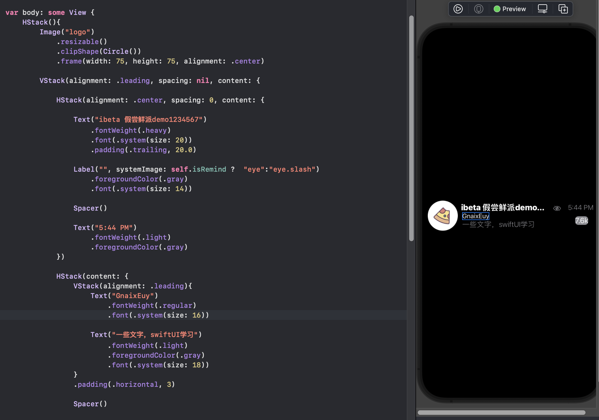

### 这是一个使用swiftUI 做的仿telegram app，自己造，代码糙，交流练习勿喷

---

* 2021年8月20日:项目init  写了一点最基本的text

* 2021年8月21日: 修改了前面一些写的有问题的地方，完成了单条信息界面

  

* 2021年8月22日: 加入了导航栏、标题栏、跳转设定，修改了某些提示信息在黑夜模式下不可见的问题，加入了是否提醒按钮可点击

  

* 2021年8月23日: :star:加入了基本的联系人界面

  ​							:memo:对诶我正在学emoji的代表含义，有点累今天就偷懒到这

  

* 2021年8月24日: :lipstick: ​简单做了联系人条目的样式 ; :art:稍微整理了目录结构

  

* 2021年8月26日: :rocket:添加了添加用户模态框

* 完成了模态框的一些细节；写了呼叫界面的navigation；写了联系人排序的actionSheet（功能未做，等待界面基本完成开始做各功能）

